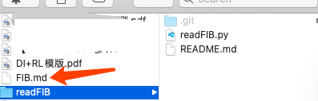
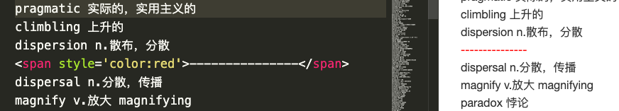
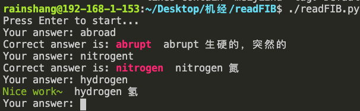

# readFIB
Erm...我是有多不想学PTE哦...

Well, I write another tool to **'help'** me to learn PTE since the [crawler](https://github.com/rainshang/60sScienceCrawler).

It is a python3 script this time, to practise word dictation.

Basically just run it and it will read the `FIB.md` file in parent directory by default. Also, I allow you to input the file as the argument.

The `FIB.md` should be like this,

all the non-word lines like the `` will be ignored.

Then press any key to begin your dictation. **Notice:** please enter your answer after the `Your answer: ` shows. I know it's slow, limited by the text-to-speech lib though.

Again, fcking good luck!